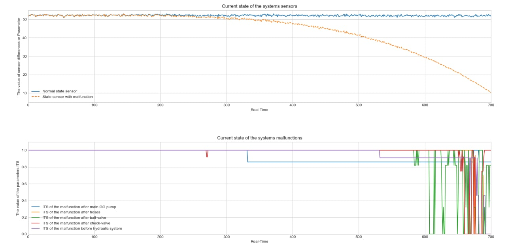

# Fault_diagnosis_using_hybrid_analytics
The purpose of this project is to generate the methodology for prescriptive analytics of dynamic equipment using hybrid modeling. The methodology allows predicting a specific place of that malfunction and its numeric value of the malfunction parameter.   As an example of a dynamic system, the Industrial Gas Turbine is investigated. This project aims to use generated data of the real malfunction parameters for Oil and Hydraulic subsystems using mathematical modeling and then to build the regression model for predicting the index technical state (ITS) of each of the malfunctions.
# Turbine

This is the image of an Industrial Gas Turbine.
## Oil lubrication turbine subsystem
A gas turbine is a very complex dynamic system. The oil lubrication subsystem is very crucial for providing lubricant to the bearings.  In real life, this subsystem operates almost without malfunctions. And the problem is that there are no data for predicting all potential malfunctions occurring in that kind of subsystem. Using hybrid modeling, it's possible (physics-based approach plus machine learning methods).

### Results on leakages real-time monitoring
An overall methodology fall into the following steps:
1.	Collecting the data from an industrial partner about the subsystem (`csv-file`).
2.	Designing a mathematical model (e.g. using Amesim, Matlab, Python);
3.	Simulation and optimization processes in the model;
4.	Investigating the actual malfunctions which can occur in the actual subsystem according to the documentation from Industrial partners;
5.	Generating the data of the different malfunctions;
6.	To make a table of correlations between the malfunctions parameter and specific outputs according to the documents from Industrial partner;
7.	Analyzing the data using machine learning methods;
8.	Building matrices of influences for the whole subsystem; 
9.	Using existing classification model to classify different malfunctions in the subsystem;
10.	Building a predicting model for the whole subsystem to allow to predict each of the malfunctions;
11.	Building the real-time classification and prediction model using time series prediction. 

# Further information
For using this methodology, you should e-mail me and I'll help you with:
1) How to build mathematical model;
2) How to generate data from math model using `Python`;
3) How to build ML-modeels based generated data;
4) How to operate with ML-models in real-time application using awesome `Streamlit` (will add some information on it a bit latter);

Don' hesitate to write me via e-mai: aleksandryessin@gmail.com.
