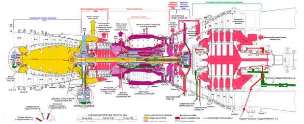
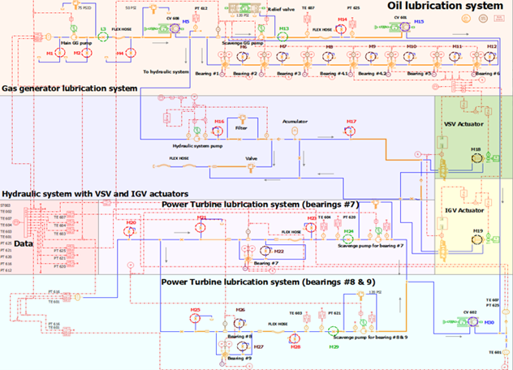

# Fault_diagnosis_using_hybrid_analytics
The purpose of this project is to generate the methodology for prescriptive analytics of dynamic equipment using hybrid modeling. The methodology allows predicting a specific place of that malfunction and its numeric value of the malfunction parameter.   As an example of a dynamic system, the Industrial Gas Turbine is investigated. This project aims to use generated data of the real malfunction parameters for Oil and Hydraulic subsystems using mathematical modeling and then to build the regression model for predicting the index technical state (ITS) of each of the malfunctions.
# Turbine

## Oil lubrication turbine subsystem

### Results on leakages real-time monitoring

# Further information
For using this methodology, you should e-mail me and I'll help you with:
1) How to build mathematical model;
2) How to generate data from math model using `Python`;
3) How to build ML-modeels based generated data;
4) How to operate with ML-models in real-time application using awesome `Streamlit` (will add some information on it a bit latter);

Don' hesitate to write me via e-mai: aleksandryessin@gmail.com.
